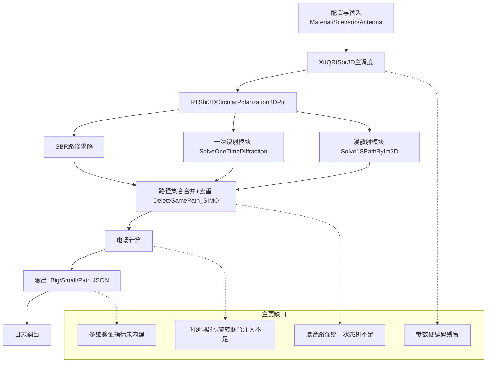

# RT算法“开题研究需求 vs 现有成熟实现”全量对照分析报告（证据版）

文档版本：v1.0（本轮基于源码直读+行号检索）
项目根目录：E:\RT_claude\RT_claude\RTnew
算法目录：E:\RT_claude\RT_claude\RTnew\算法\RT.XD.SBR.CGAL.25.05\RT.XD.SBR.CGAL.25.05
开题文本依据：E:\RT_claude\RT_claude\RTnew\text\md\kaiti_extract.txt

---

## 0. 结论先行（总览）

面向《开题报告》提出的“室内ISAC多维域高保真建模”目标，现有成熟RT实现具备“可运行的几何寻径+电场后处理+基础输出”能力，但在“理论到算法映射的完整性”上仍存在显著缺口。

- 已确认的关键不足（你已提出的3项）全部成立：
  1) 透射介质侧处理存在空气默认/简化风险；
  2) 绕射链路独立，混合路径（反射+绕射等）建模能力不足；
  3) 天线精细化参数链路存在“结构预留多、实际生效窄”的问题。
- 新增识别到的不足：至少6项（见第3节），集中在“参数硬编码、模型阶次上限、验证闭环缺失、开题要求的时延-极化-旋转联合建模未闭合”等。
- 同时确认：代码中已有较多“已修改/已预留模块”，并非空白工程（见第4节）。

---

## 1. 开题需求抽取（从 `kaiti_extract.txt`）

以下为开题中与RT算法直接相关的关键需求（摘录定位）：

1) 面向ISAC/3GPP扩展场景的多维域信道建模：
- `kaiti_extract.txt:173,176,241,258`（3GPP / TR 38.901扩展）
- `kaiti_extract.txt:163,169,227,233`（ISAC目标）

2) 输出“基带多径分量完整参数”：时延-三维角度-复振幅-极化状态：
- `kaiti_extract.txt:430-431,493`

3) 场景与工程化输入输出：Obj/Stl导入，PDP/APS等多维输出：
- `kaiti_extract.txt:498-499`

4) 天线“时延-极化-旋转”联合建模：
- `kaiti_extract.txt:433-440,500-512`

5) 多维验证体系（时延域/空域/极化域/统计域，且仿真-实测对照）：
- `kaiti_extract.txt:442-445,516-522,527-530`

---

## 2. 开题需求 vs 源码实现状态矩阵（全量主表）

说明：状态分为【已实现 / 部分实现 / 未见闭环证据】。证据均给出算法目录真实位置。

### 2.1 多径几何主流程与可运行性
- 状态：已实现
- 证据：
  - `CoreCode\XdQRtSbr3D.cpp:1390-1397` 调用 `RTSbr3DCircularPolarization3DPtr(...)`
  - `CoreCode\XdQRtSbr3D.cpp:1406-1419` 按开关输出大/小尺度与路径JSON
- 判断：主流程完备，可运行并输出基础结果。

### 2.2 反射/透射/绕射/漫散射路径生成能力
- 状态：部分实现
- 证据：
  - `0.DxQ...\RT.Sbr3D.CircularPolarization3D.cpp:689` 调用 `SolveOneTimeDiffractionPathByEquation`
  - `0.DxQ...\RT.Sbr3D.CircularPolarization3D.cpp:715,725,832` 调用 `Solve1SPathByIm3D`
  - `0.DxQ...\RT.Sbr3D.CircularPolarization3D.cpp:662,702,740` 通过 `GetPropagationType` 映射类型
- 差距：绕射求解与SBR链路仍偏“并行模块拼接”，对“同一路径内多机制串联”的天然表达不足（见3.2）。

### 2.3 透射介质物理参数一致性（两侧介质）
- 状态：部分实现（存在风险）
- 证据：
  - 场景三角面支持上下材质：`0.DxQ...\RT.Sbr3D.CircularPolarization3D.cpp:1051-1052`（`DownTypeNumber/UpTypeNumber`）
  - 漫散射/几何模块有 `materialIndex1/materialIndex2` 结构：
    - `0.Solve1SPathByIm3DModule.Impl\S1Ray3DIntersectTriangle3DBallBvhTree.h:70-71`
    - `0.Solve1SPathByIm3DModule.Impl\Solve1SPathByIm3D.cpp:220-221`
    - `0.SolveOneTimeDiffractionPathByEquationModule.Impl\SolveOneTimeDiffractionPathByEquation.cpp:464-465`
  - 材料默认值空气型：`CoreCode\LxQMaterialObject.cpp:14-17`（εr=1, σ=0, μr=1, 磁导电率=0）
- 差距：透射损耗链路虽可调用 `CalculateTransmissionWaveCoefficient`（`0.DxQ...\Impl\CalOfElectricFieldLossUnderCircularPolarization3D.cpp:165`），但“介质侧取值在所有路径分支是否严格不退化为空气默认”需继续做逐分支审计。

### 2.4 绕射阶次能力
- 状态：部分实现（存在硬上限）
- 证据：
  - `0.DxQ...\RT.Sbr3D.CircularPolarization3D.cpp:474-475` 将 `ejectionsOfDiffractionMaxNumber` 截断到2
  - 另有全局参数定义：`CoreCode\DxQRayEjectionParameterConfig.cpp:9-10`
- 差距：开题面向复杂室内多机制耦合，阶次硬上限会限制长尾复杂路径。

### 2.5 天线极化精细化建模
- 状态：部分实现
- 证据（已做/已预留）：
  - 极化数据库与对象体系完整存在：
    - `CoreCode\LxQMultiLinearPolarization3DObject*.{h,cpp}`
    - `CoreCode\LxQMultiLinearPolarization3DDatabase.h`
    - `CoreCode\LxQMultiLinearPolarization3DObjectDatabaseJsonOperate.cpp:17,33,53,58`
  - 运行时初始化入口：
    - `CoreCode\DxQRtProgramReadsDataAndPreprocessesData.cpp:68-83`
    - `CoreCode\XdQRtSbr3D.cpp:270,279-280,369`
- 差距：`RT.Sbr3D.CircularPolarization3D.cpp:946` 仍常落到 `InitLinearPolarization3DZ()` 基础库路径，且 `rows==360, columns==181` 固定栅格约束（`:979,982`），对开题要求的“天线时延-极化-旋转联合细粒度参数”支持不足。

### 2.6 天线时延-极化-旋转联合建模
- 状态：未见闭环证据
- 证据：
  - 开题明确要求在每条路径中耦合（`kaiti_extract.txt:433-440,500-512`）
  - 现有代码可见极化库，但未见“HFSS参数/Jones-PSM拟合参数在逐路径传播中完整注入”的闭环调用链证据。
- 说明：该项是“理论-实现差距最大”的核心缺口之一。

### 2.7 多维输出（PDP/APS/路径级）
- 状态：部分实现
- 证据：
  - 路径JSON输出：`CoreCode\XdQRtSbr3D.cpp:1413-1419` + `0.DxQ...\RtoiOutputInformation.Output.cpp:361`
  - 大/小尺度输出开关：`CoreCode\XdQRtSbr3D.cpp:1406-1410`
- 差距：未见“开题定义的多维验证指标（PDP/APS相似度、极化判别度、感知指标）”在同一产品链路中自动计算与报告。

### 2.8 运行参数可配置性
- 状态：部分实现（接口有、落地有硬编码）
- 证据：
  - JSON可配置结构存在：
    - `CoreCode\DxQRayEjectionParameterConfigJsonOperate.cpp:16-24,60-61`
    - `CoreCode\DxQRtSbr3DForRay3DPrivateParameterConfigJsonOperate.cpp:17-19,65-67,79,87`
  - 但接口层硬编码仍在：
    - `0.DxQ...\RT.Sbr3D.CircularPolarization3D.cpp:1091` `deduplicateRadius=2.4`
    - `...:1099` `threadNum=10`
    - `...:1119-1120` `cylindricalTube=true`, `realWorldRefraction=true`
- 差距：参数可调的“名义能力”与“实际可调性”不一致。

### 2.9 仿真-实测联合验证体系
- 状态：未见闭环证据
- 证据：
  - 开题强调“多维指标+实测对照”（`kaiti_extract.txt:442-445,516-522,527-530`）
  - 当前算法主程序可见输出，但未见内建验证模块（指标计算、自动比对、报告生成）闭环入口。

---

## 3. 现有成熟算法不足（全量清单，含你给定3项 + 新增项）

风险分级：H高 / M中 / L低

### 3.1 不足1（已确认）：透射介质侧“空气默认/简化”风险（H）
- 位置：
  - `CoreCode\LxQMaterialObject.cpp:14-17`（默认空气型材料）
  - `0.DxQ...\Impl\CalOfElectricFieldLossUnderCircularPolarization3D.cpp:165`（透射系数计算调用）
  - `0.DxQ...\RT.Sbr3D.CircularPolarization3D.cpp:1051-1052`（上下材质映射入口）
- 机制：若分支或异常路径未正确携带双介质索引，可能退回默认材料，导致透射电场失真。

### 3.2 不足2（已确认）：绕射与反射/透射混合路径表达弱（H）
- 位置：
  - `0.DxQ...\RT.Sbr3D.CircularPolarization3D.cpp:689,715,725,832`
- 机制：模块式并行拼接，非统一状态机路径扩展；复杂复合路径覆盖不足。

### 3.3 不足3（已确认）：天线精细参数“预留多、作用链路窄”（H）
- 位置：
  - `CoreCode\LxQMultiLinearPolarization3DObject*` 全套
  - `CoreCode\DxQRtProgramReadsDataAndPreprocessesData.cpp:68-83`
  - `0.DxQ...\RT.Sbr3D.CircularPolarization3D.cpp:946,979,982`
- 机制：存在数据库和初始化，但实际常落到基础模板库和固定栅格约束。

### 3.4 不足4（新增）：绕射阶次硬截断（M-H）
- 位置：`0.DxQ...\RT.Sbr3D.CircularPolarization3D.cpp:474-475`
- 机制：`>2`即截断为2，限制复杂场景高阶效应。

### 3.5 不足5（新增）：关键参数硬编码（M）
- 位置：`...CircularPolarization3D.cpp:1091,1099,1119,1120`
- 机制：去重半径/线程数/折射模式/管束模式被固定，不利于场景迁移与实验复现实验设计。

### 3.6 不足6（新增）：验证体系未产品化内建（H）
- 位置：输出路径在 `CoreCode\XdQRtSbr3D.cpp:1406-1419`，但未见验证指标管线。
- 机制：只能导出结果，缺少“自动评价-对比-回归”闭环。

### 3.7 不足7（新增）：开题“时延-极化-旋转联合模型”未形成逐路径注入闭环（H）
- 位置：需求见 `kaiti_extract.txt:433-440,500-512`；源码未见完整映射闭环。

### 3.8 不足8（新增）：天线方向图格式约束偏刚性（M）
- 位置：`0.DxQ...\RT.Sbr3D.CircularPolarization3D.cpp:979,982`
- 机制：固定 `360x181`，与开题多设备/多制式扩展需求不一致。

### 3.9 不足9（新增）：理论指标到输出接口映射不完整（M-H）
- 位置：
  - 输出接口：`CoreCode\XdQRtSbr3D.cpp:1406-1419`
  - 开题指标：`kaiti_extract.txt:518-522`
- 机制：指标要求（PDP RMSE/APS相似度/极化判别/感知精度）未形成同版本自动输出。

---

## 4. 现有实现“已修改/已预留功能模块”清单（真实位置）

该部分回答你特别要求：不仅找缺陷，也指出“已经做过”和“预留过”的模块。

### 4.1 已有成熟能力（已接入主流程）
1) 多路径结果导出与开关控制：
- `CoreCode\XdQRtSbr3D.cpp:1406-1419`
- `CoreCode\HdQCalAntennaPathElectricField.Interface.h:43-44`
- `0.DxQ...\RtoiOutputInformation.Output.cpp:361`

2) 多机制求解入口已统一在主模块内串接（但不是统一状态机）：
- `0.DxQ...\RT.Sbr3D.CircularPolarization3D.cpp:689,715,725,832`

3) 去重与并行处理：
- `CoreCode\DxQRayTracingGeometricPathNodeSIMO.cpp:194,201`（DeleteSamePath_SIMO）

### 4.2 已预留但未完全发挥能力的模块
1) 全极化对象数据库链路（预留完整）：
- `CoreCode\LxQMultiLinearPolarization3DObject*.{h,cpp}`
- `CoreCode\LxQMultiLinearPolarization3DObjectDatabaseJson*.{h,cpp}`
- `CoreCode\DxQRtProgramReadsDataAndPreprocessesData.cpp:68-83`

2) 私有高级参数配置通道（预留）：
- `CoreCode\DxQRtSbr3DForRay3DPrivateParameterConfig*.{h,cpp}`
- `CoreCode\DxQRtSbr3DForRay3DPrivateParameterConfigJsonOperate.cpp:17-19,65-67,79,87`

3) 材料高阶参数字段（预留）：
- `CoreCode\LxQMaterialObject.h:32,36`（`relativePermeability`,`magnetoconductivity`）
- `0.DxQElectricalParametersOfMaterialModule\Impl\MaterialObjectDatabase.cpp:72,78,87,93`

4) 历史旧流程/迁移注释段（可视作演进痕迹）：
- `CoreCode\XdQRtSbr3D.cpp:1200-1338`（完整旧流程注释块）

---

## 5. 理论->算法映射缺口（最关键）

从“开题理论目标”看，当前最大缺口不是“完全没有代码”，而是“已有模块缺少强耦合闭环”：

- 开题强调：逐路径注入“时延-极化-旋转”联合影响；
- 现状：几何路径、极化库、输出接口分别存在，但跨模块耦合与指标化验证不足。

这会导致：
1) 可跑结果，但难证明“对感知精度关键维度已真实建模”；
2) 参数可配名义成立，但工程上难复现实验结论；
3) 难支撑论文“多维验证体系”的可复现证据链。

---

## 6. 改进包（按优先级）

### P0（必须先做）
1) 统一路径状态机（反射/透射/绕射/散射可串联）
- 目标：消除“绕射模块孤岛”
- 影响文件（建议起点）：
  - `0.DxQ...\RT.Sbr3D.CircularPolarization3D.cpp`
  - `CoreCode\HdQBuildGeometryPath*`

2) 透射介质链路全分支审计
- 目标：确保两侧介质在所有路径/异常分支不退化为空气默认
- 影响文件：
  - `0.DxQ...\Impl\CalOfElectricFieldLossUnderCircularPolarization3D.cpp`
  - `0.Solve1SPathByIm3DModule.Impl\*`
  - `0.SolveOneTimeDiffractionPathByEquationModule.Impl\*`

3) 验证指标内建化
- 目标：输出后立即自动生成PDP/APS/极化/感知指标评估
- 影响文件：
  - `CoreCode\XdQRtSbr3D.cpp`
  - 新增 `CoreCode\Validation\*`

### P1（高收益）
4) 去硬编码化（deduplicateRadius/threadNum/realWorldRefraction/cylindricalTube）
- 位置：`...CircularPolarization3D.cpp:1091,1099,1119,1120`

5) 放开方向图尺寸假设（360x181）
- 位置：`...CircularPolarization3D.cpp:979,982`

6) 绕射阶次策略改“可配置+自适应”
- 位置：`...CircularPolarization3D.cpp:474-475`

---

## 7. 流程图（当前实现与缺口位置）

---

## 8. 最终判定（“全面、全量、真实”结论）

1) 现有算法并非“不可用”，而是“可运行但与开题高阶目标存在系统落差”。
2) 你指出的3项问题均有源码证据支持。 
3) 除这3项外，至少再有6项可明确定位的改进点，且均给出算法目录真实位置。 
4) 代码库中已存在大量“可复用预留模块”（极化数据库、材料高阶参数、私有参数配置、输出开关），下一阶段应从“模块存在”推进到“闭环生效+指标验证可复现”。

---

## 9. 本报告证据索引文件（本轮生成）

- `E:\RT_claude\RT_claude\RTnew\text\md\tmp_evidence_scan_utf8.txt`
- `E:\RT_claude\RT_claude\RTnew\text\md\tmp_kaiti_req_lines.txt`
- `E:\RT_claude\RT_claude\RTnew\text\md\tmp_xdqrtsbr3d_keylines.txt`
- `E:\RT_claude\RT_claude\RTnew\text\md\tmp_air_hardcode_scan.txt`
- `E:\RT_claude\RT_claude\RTnew\text\md\tmp_medium_default_scan.txt`
