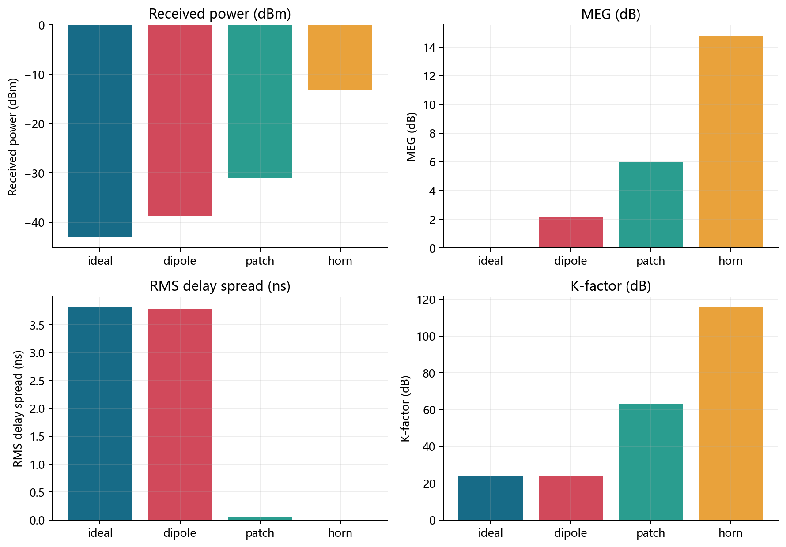
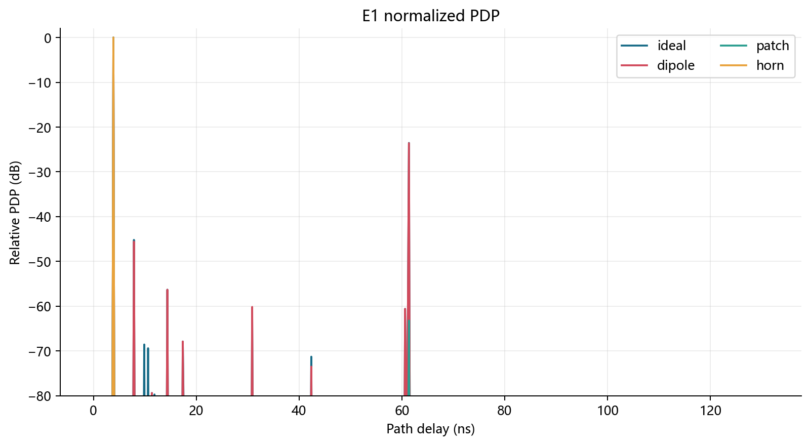
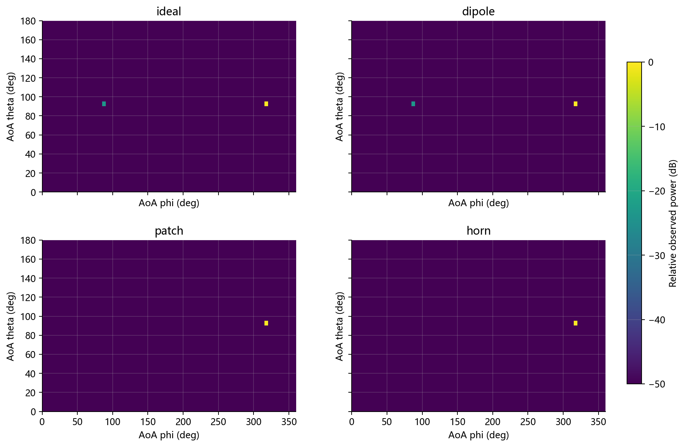
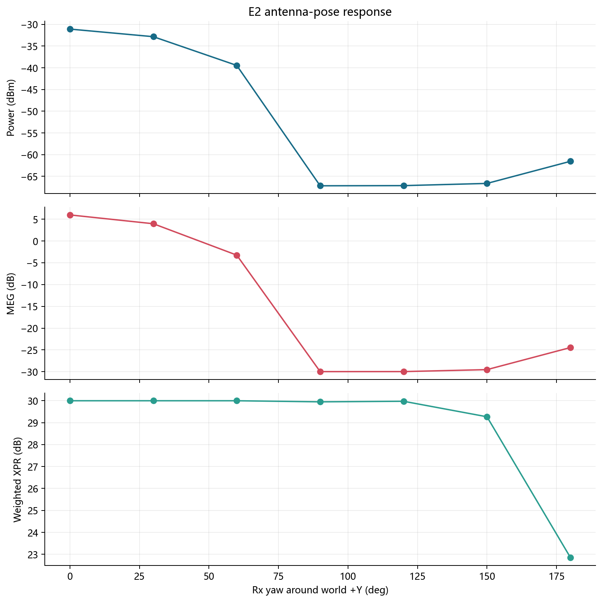
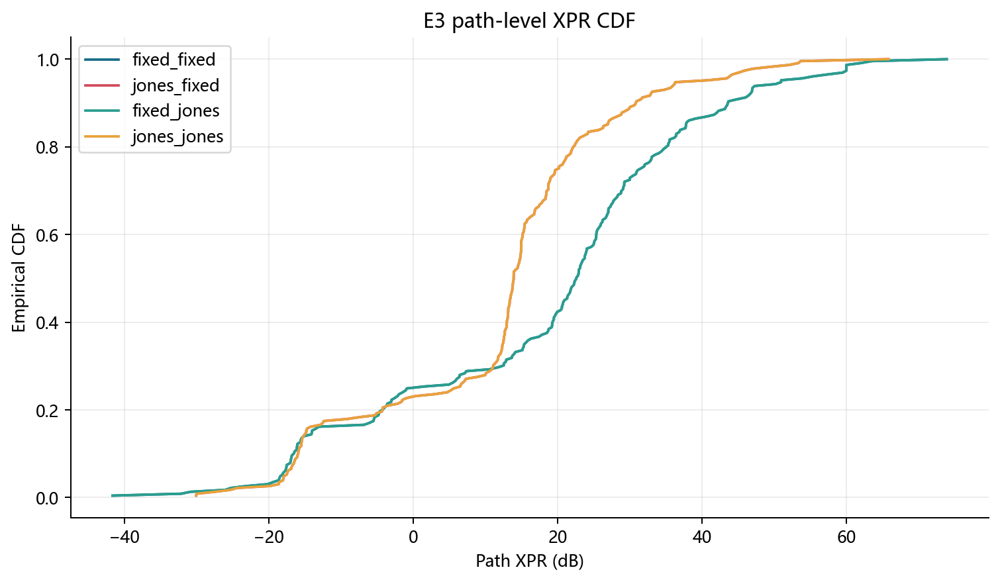
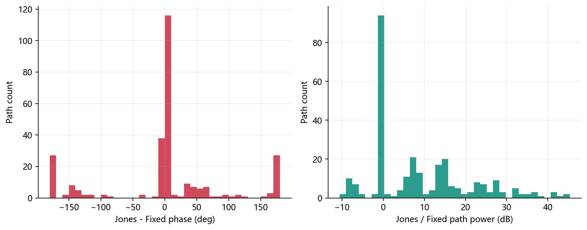
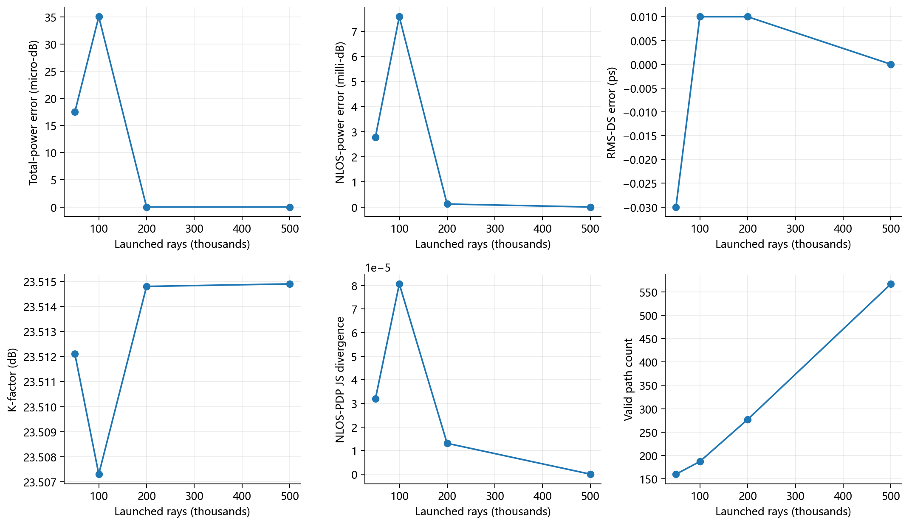
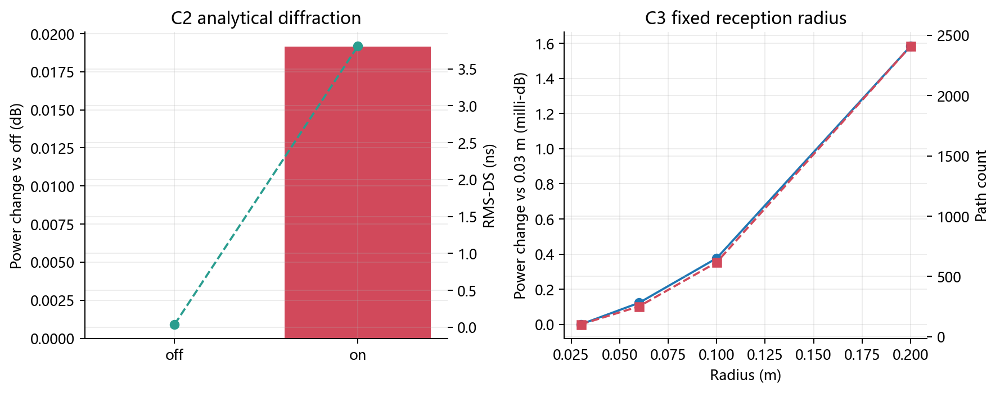

# V11.5 仿真实验分析报告

## 1. 结论摘要

27 个正式案例全部通过数据门禁，告警数为 0。3 GHz、1.131 m 的理想 LOS 理论功率约为 -43.05 dBm，仿真为 -43.043 dBm；这是自由空间基准与实现一致的首要证据。
200k 射线相对 500k 的预定义四项收敛门限判定为 **通过**。天线姿态扫描产生 36.10 dB 的动态范围，说明方向图和姿态确实进入主链。

## 2. 方法与选择理由

实验遵循“单因素对照 + 高样本参考 + 物理不变量”三层设计。E1/E2/E3 分别隔离方向图、姿态和 Jones 极化；C1 用 500k 射线作数值参考；C2/C3 检查绕射与接收球敏感性。选择 RMS-DS、K-factor、APS、MEG 和 XPR，是因为它们分别约束时延、LOS/NLOS 功率比、到达角、方向图平均耦合及极化耦合，能避免仅凭总功率得出结论。权威定义和公式见 [方法调研与实验设计](v11.5_方法调研与实验设计.md)。

## 3. 零基础读图说明

dBm 是对数功率：增加 3 dB 约等于功率翻倍。RMS-DS 越大，表示显著多径在时间上铺得越开。K-factor 越大，表示 LOS 相对 NLOS 越强。MEG 是天线增益按实际入射角功率加权后的平均值。XPR 越大，表示同极化功率相对交叉极化越强。JS 距离为 0 表示两个归一化功率分布相同，越接近 1 差异越大。

## 4. 数据质量与可追溯性

共分析 27 个案例。每个案例均检查：路径数与统计文件一致、几何签名无重复、复振幅平方可重建路径功率、所有数值有限、观测 APS 的 bin 功率之和等于总路径功率。运行清单另保存可执行文件/配置哈希和 Git 状态。

## 5. E1 天线模型

| 模型 | 接收功率 (dBm) | MEG (dB) | RMS-DS (ns) | K (dB) |
|---|---:|---:|---:|---:|
| ideal | -43.043 | 0.000 | 3.8079 | 23.515 |
| dipole | -38.742 | 2.137 | 3.7781 | 23.585 |
| patch | -31.062 | 5.968 | 0.0397 | 63.151 |
| horn | -13.062 | 14.808 | 0.0001 | 115.526 |

横轴为天线模型，四个子图依次是绝对接收功率、MEG、RMS-DS 和 K-factor。偶极子把 `forward` 定义为竖直振子轴，因此水平 Tx-Rx 链路位于最大辐射平面；patch/horn 的主瓣对准 LOS。理想、patch 和 horn 的 LOS 功率增量应分别接近 0、12 和 30 dB，这对应 Tx/Rx 两端峰值增益之和。

横轴是路径时延，纵轴是各模型相对自身最强时延 bin 的功率。它比较的是多径形状，不是模型间绝对功率。定向天线抑制晚到达路径时，尾部下降并伴随 RMS-DS 减小。

横轴是世界方位角，纵轴是天顶角，颜色是相对最强角度 bin 的功率。这里是经过 Rx 方向图后的观测 APS；入射 APS 也已单独导出，供 MEG 计算使用，二者不能混用。

## 6. E2 姿态扫描

Rx 绕世界 +Y 轴旋转。功率动态范围为 36.10 dB，最强案例为 `yaw000`。若主瓣偏离主要到达方向，功率和 MEG 应共同下降；XPR 还会因 co/cross 基底与 Jones 响应改变。曲线无需左右对称，因为室内到达角谱并不对称。

## 7. E3 极化模型

CDF 横向移动表示整体 XPR 改变，斜率变化表示不同路径受影响不一致。纯 co/cross 状态按 ±60 dB 截尾后纳入统计，避免把物理上有意义的纯极化路径静默删除。

按几何签名配对 277 条路径。Jones-Jones 相对固定极化的相位差绝对值中位数为 5.79 度，功率差绝对值中位数为 7.651 dB。它证明 Jones 幅相信息进入链路，但当前 Jones 文件是解析/合成基准，不能声称代表某一实测或 HFSS 天线。

## 8. C1 数值收敛

六个子图均以 500k 为参考或直接展示稳定量。图中 micro-dB 是百万分之一 dB，milli-dB 是千分之一 dB，ps 是千分之一 ns。200k 的总功率误差为 0.0000 dB，NLOS 功率误差为 0.0001 dB，RMS-DS 误差为 0.0000 ns，NLOS-PDP JS 距离为 0.00001。使用 NLOS 指标是为了防止强 LOS 把弱多径的未收敛隐藏掉。门限为 0.1 dB、1 dB、0.5 ns 和 0.1。

## 9. C2/C3 敏感性

左图柱表示开启解析绕射相对关闭时的总功率变化（0.0191 dB），折线表示 RMS-DS。绕射总功率虽弱，晚到达分量仍可能显著改变 RMS-DS。右图将固定接收球半径从 0.03 m 扫到 0.20 m：路径数会增加，但总功率跨度只有 0.0016 dB；这支持采样权重已抑制“命中越多、功率越大”的伪效应。

## 10. 跨场景检查

meeting 场景中，ideal 为 -53.129 dBm，patch 为 -41.147 dBm。第二场景复现了定向天线增益趋势，说明结论不是 412 场景单点偶然。它仍不是统计意义上的场景泛化，需要更多位置和 NLOS 点位。

## 11. 剩余风险与论文表述边界

1. 材料数据库沿用项目既有 ITU-R P.2040-1 参数口径，而当前建议书已有更新版本；在升级数据库前，不应把绝对损耗称为最新标准结果。
2. patch/horn 与 Jones 文件是参数化验证资产，不是实测或全波数据；可用于验证算法趋势，不可用于宣称真实天线性能。
3. 当前绕射实验验证的是已接入的解析绕射开关；`diffraction_rays_per_event` 尚未成为主链有效自变量，报告没有伪造其扫描结论。
4. 500k 是当前场景/点位的数值参考，不是真值。缺少暗室天线数据和信道实测，因此外部有效性仍待验证。
5. 动态接收半径通过功率稳定性检查，但更复杂遮挡、纯 NLOS 和多接收机布置仍需专项回归。

因此，当前证据支持“实现符合自由空间、方向图、极化和采样权重的理论趋势”，不支持“已达到真实场景测量精度”的更强结论。
